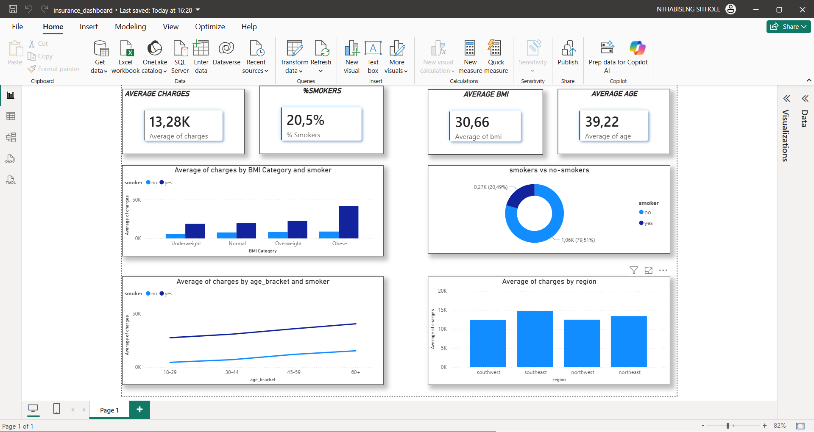
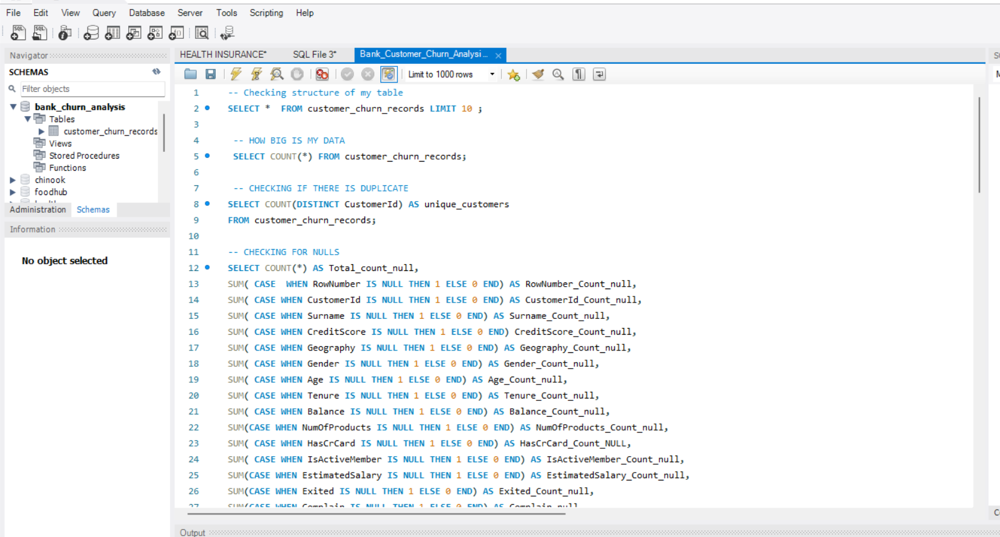
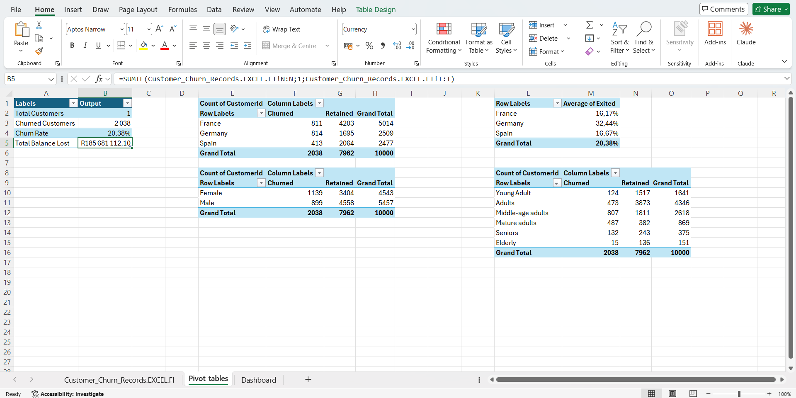

# Bank-Customer-Churn-Analysis
End-to-end customer churn analysis using SQL, Power BI, and Excel. Identifies key retention drivers, high-risk customer segments, and strategic recommendations to protect bank liquidity.
# 🏦 Bank Customer Churn Analysis
## 📌 Project Overview
This project analyzes customer attrition across **10,000 banking customers** to identify why customers leave and how the bank can improve retention.
---
## 🖼️ Project Showcase
### 📈 Power BI Interactive Dashboard

---
### 🗄️ MySQL Analysis & Querying

---
### 📊 Excel Data Exploration

---
## 🎯 Key Metrics (KPIs)
* **Total Customers:** 10,000[cite: 5]
* **Retained Customers:** 7,963 (79.63%)[cite: 5]
* **Churned Customers:** 2,037 (20.37%)[cite: 5]
* **Overall Churn Rate:** 20.37%[cite: 5]
---
## 💡 Key Insights
* **🌍 Location:** **Germany** has a **32.44%** churn rate—nearly double France (16.17%) and Spain (16.67%)[cite: 5].
* **👥 Age:** High churn is concentrated in older demographics: **50–59 years (56.04%)** and **60–69 years (35.20%)**[cite: 5]. Customers under 40 churn at less than 11%[cite: 5].
* **💳 Products:** **2-product holders** are the most loyal (**7.60% churn**)[cite: 5]. Single-product holders churn at **27.71%**, while holders of 3+ products churn at **82%+**[cite: 5].
* **👤 Activity:** Inactive members churn almost twice as fast (**26.87%**) as active members (**14.27%**)[cite: 5].
* **💰 Financial Risk:** Churned customers hold **~25% higher balances** (R91,109 vs. R72,742), posing a liquidity risk[cite: 5].
---
## 🚀 Strategic Recommendations
1. **Re-engage Inactive Members:** Run automated re-engagement campaigns and promotional rates[cite: 5].
2. **Promote the 2-Product Sweet Spot:** Cross-sell a second product to single-product holders to increase loyalty[cite: 5].
3. **Address Regional Friction:** Conduct targeted feedback surveys in Germany to fix local pain points[cite: 5].
4. **Protect High-Balance Accounts:** Offer tailored wealth management products for mature customers (ages 40–59)[cite: 5].
---
## 📁 Repository Structure
```text
Bank-Customer-Churn-Analysis/
│
├── README.md
├── powerbi_dashboard.png
├── mysql_queries.png
├── excel_analysis.png
└── Bank_Customer_Churn_Analysis.sql
